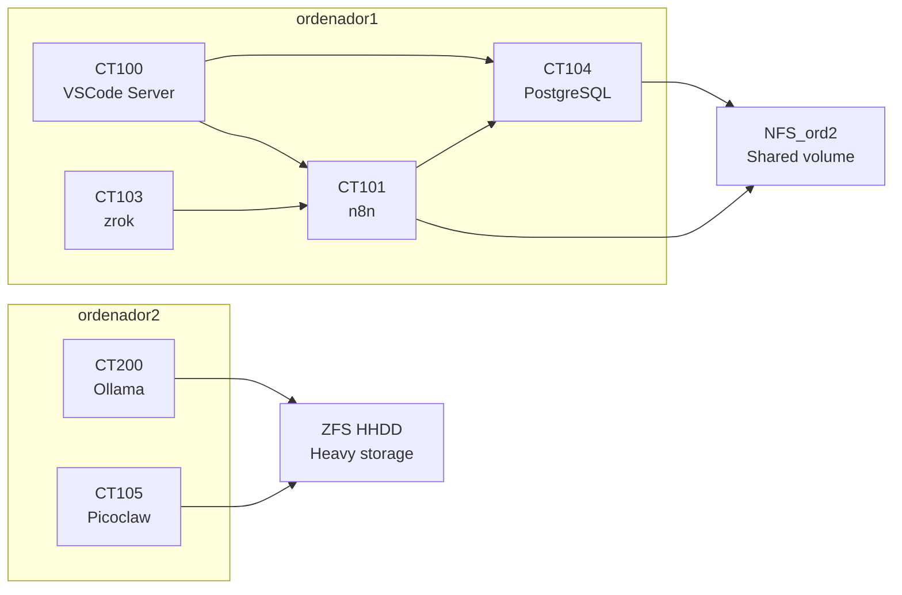
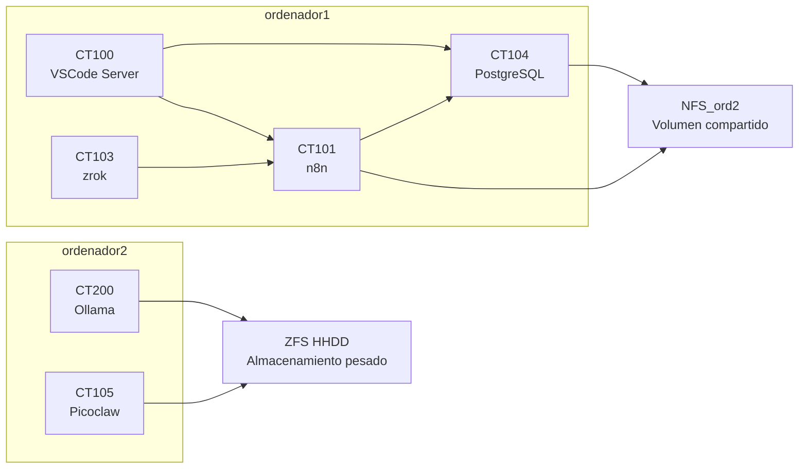

# 🏠 Homelab — Proxmox Cluster (English)

[Jump to Español](#spanish)

## 📌 Contents

- [Access and scope](#-access-and-scope)
- [Cluster nodes](#-cluster-nodes)
- [Node distribution](#-node-distribution)
- [Cluster architecture](#-cluster-architecture)
- [Storage](#-storage)
- [Key technical decisions](#-key-technical-decisions)
- [Services and containers](#-services-and-containers)
- [Container details](#-container-details)
- [Documentation](#-documentation)
- [Future recommendations](#-future-recommendations)
- [Skills showcased](#-skills-showcased)

Personal infrastructure built with Proxmox VE 9.1.9 across 2 physical nodes and an LXC container architecture for remote development, automation, local AI, and data.

## 🚧 Access and scope

- This repository documents the cluster architecture, containers, and the automation used to keep the system up to date.

## 🖥️ Cluster nodes

| Node | CPU | RAM | Role |
|------|-----|-----|-----|
| ordenador1 | Intel i5-5300U (4 threads) | 5.7 GB | Primary services and Proxmox management |
| ordenador2 | Intel i7-6700HQ (8 threads) | 15 GB | Local AI with GPU and ZFS storage |

## 🧩 Node distribution

- **ordenador1**: `CT100` VSCode Server, `CT101` n8n, `CT103` zrok, `CT104` PostgreSQL. This node hosts cluster management and lightweight backend services.
- **ordenador2**: `CT200` Ollama, `CT105` Picoclaw. This node handles local AI and agents with higher memory/GPU demand.

## 🧭 Cluster architecture

## 💾 Storage

- **NFS_ord2** (~894 GB) shared between both nodes for persistent data.
- **ZFS HHDD** (~900 GB) on `ordenador2` for high-volume data and snapshots.
- **local-lvm** on each node for operating systems and container disks.

## 🔧 Key technical decisions

- **LXC** for lightweight containers with lower overhead on home hardware.
- **Proxmox** for orchestrating physical nodes, containers, and networks.
- **PostgreSQL on NFS** for shared persistence and data mobility.
- **Ollama on node 2** for local AI model execution with GPU.
- **zrok** for exposing internal services without opening router ports.
- **Tailscale** for secure remote access to the management interface.

## 🚀 Services and containers

| Container | Service | Purpose |
|-----------|---------|---------|
| CT100 | VSCode Server | Remote browser-based development environment |
| CT101 | n8n | Automation workflows and task orchestration |
| CT103 | zrok | Secure tunnel for exposing internal services |
| CT104 | PostgreSQL | Relational database stored on shared NFS volume |
| CT200 | Ollama | Local AI / LLM platform with GPU passthrough |
| CT105 | Picoclaw | AI agents runtime for experimentation |

## 📌 Container details

### CT100 — VSCode Server
- Ubuntu 24.04
- 2 CPU, 4 GB RAM, 100 GB on `local-lvm`
- Remote development environment for working inside the homelab.

### CT101 — n8n
- Detected version: 2.19.5
- Local automation and workflow platform.
- Integrates with AI services and the local database.

### CT103 — zrok
- Secure tunnel for internal services.
- Enables inbound traffic without NAT/router changes.

### CT104 — PostgreSQL
- PostgreSQL 18.3
- Data mounted on `NFS_ord2` for shared persistence.
- Useful for internal apps and AI projects.

### CT200 — Ollama
- Local AI / LLM server
- 6 CPU cores and GPU passthrough
- Hosted on `ordenador2` for increased RAM capacity.

### CT105 — Picoclaw
- Lightweight AI agents runtime
- Container for automation and intelligent flow experimentation.

## 📚 Documentation

- `docs/cluster-summary.md` — cluster status summary.
- `docs/node-ordenador1.md` — hardware and container details for `ordenador1`.
- `docs/node-ordenador2.md` — hardware and container details for `ordenador2`.
- `containers/*/info.md` — metadata for each LXC container.

## 📝 Future recommendations

- Add direct URLs for services like `n8n`, `Ollama`, and `VSCode Server` when available.
- Document concrete use cases for automation and AI models.
- Include a simple architecture diagram or network map.
- Add notes on backup/restore for `NFS_ord2` and `ZFS HHDD`.
- Document the authentication method used for Proxmox and Tailscale.

## 🧠 Skills showcased

- Proxmox cluster design with multi-node LXC orchestration.
- Infrastructure documentation for public-facing repositories.
- Local AI deployment with GPU passthrough using Ollama.
- Workflow automation using n8n and secure tunnel exposure with zrok.
- Shared storage strategy with NFS and ZFS for persistence and performance.

---

# 🏠 Homelab — Proxmox Cluster (Español)

[Jump to English](#english)

## 📌 Contenido

- [Acceso y alcance](#-acceso-y-alcance)
- [Nodo del clúster](#-nodo-del-clúster)
- [Distribución por nodo](#-distribución-por-nodo)
- [Arquitectura del clúster](#-arquitectura-del-clúster)
- [Almacenamiento](#-almacenamiento)
- [Decisiones técnicas](#-principales-decisiones-técnicas)
- [Servicios y contenedores](#-servicios-y-contenedores)
- [Detalles de contenedores](#-detalles-de-contenedores)
- [Documentación](#-documentación)
- [Recomendaciones futuras](#-recomendaciones-futuras)
- [Habilidades demostradas](#-habilidades-demostradas)

Infraestructura personal con Proxmox VE 9.1.9, 2 nodos físicos y una arquitectura de contenedores LXC para desarrollo remoto, automatización, IA local y datos.

## 🚧 Acceso y alcance

- Este repositorio documenta la arquitectura, los contenedores y la automatización usada para mantener el clúster actualizado.

## 🖥️ Nodo del clúster

| Nodo | CPU | RAM | Rol |
|------|-----|-----|-----|
| ordenador1 | Intel i5-5300U (4 hilos) | 5.7 GB | Servicios principales y gestión Proxmox |
| ordenador2 | Intel i7-6700HQ (8 hilos) | 15 GB | IA local con GPU y almacenamiento ZFS |

## 🧩 Distribución por nodo

- **ordenador1**: `CT100` VSCode Server, `CT101` n8n, `CT103` zrok, `CT104` PostgreSQL. Este nodo concentra la gestión del clúster y servicios de backend ligeros.
- **ordenador2**: `CT200` Ollama, `CT105` Picoclaw. Este nodo soporta IA local y agentes con mayor demanda de memoria/GPU.

## 🧭 Arquitectura del clúster

## 💾 Almacenamiento

- **NFS_ord2** (~894 GB) compartido entre ambos nodos para datos persistentes.
- **ZFS HHDD** (~900 GB) en `ordenador2` para datos de alto volumen y snapshots.
- **local-lvm** en cada nodo para sistemas operativos y discos de contenedores.

## 🔧 Principales decisiones técnicas

- **LXC** para contenedores ligeros con menor overhead en hardware doméstico.
- **Proxmox** para orquestación de nodos físicos, contenedores y redes.
- **PostgreSQL en NFS** para persistencia compartida y migración de datos.
- **Ollama en nodo 2** para ejecución local de modelos IA con GPU.
- **zrok** para exponer servicios internos sin abrir puertos de router.
- **Tailscale** para acceso remoto seguro a la interfaz de administración.

## 🚀 Servicios y contenedores

| Contenedor | Servicio | Propósito |
|------------|----------|-----------|
| CT100 | VSCode Server | Entorno de desarrollo remoto en navegador |
| CT101 | n8n | Automatización de workflows y orquestación de tareas |
| CT103 | zrok | túnel seguro para exponer servicios internos |
| CT104 | PostgreSQL | Base de datos relacional con volumen NFS compartido |
| CT200 | Ollama | Plataforma local de IA / LLM con GPU passthrough |
| CT105 | Picoclaw | Runtime de agentes IA para experimentación |

## 📌 Detalles de contenedores

### CT100 — VSCode Server
- Ubuntu 24.04
- 2 CPU, 4 GB RAM, 100 GB en `local-lvm`
- Entorno de desarrollo remoto para trabajar dentro del homelab.

### CT101 — n8n
- Versión detectada: 2.19.5
- Plataforma de automatización y workflows locales.
- Integrable con servicios IA y la base de datos local.

### CT103 — zrok
- Túnel seguro para servicios internos.
- Permite tráfico entrante sin configuración de NAT en el router.

### CT104 — PostgreSQL
- PostgreSQL 18.3
- Datos montados en `NFS_ord2` para persistencia compartida.
- Útil para aplicaciones internas y proyectos de IA.

### CT200 — Ollama
- Servidor de IA local / LLM
- 6 CPU y GPU passthrough
- Ejecutado en `ordenador2` con mayor RAM disponible.

### CT105 — Picoclaw
- Runtime de agentes IA ligero
- Contenedor orientado a experimentación de automatización y flujos inteligentes.

## 📚 Documentación

- `docs/cluster-summary.md` — resumen de estado del clúster.
- `docs/node-ordenador1.md` — detalles de hardware y contenedores de `ordenador1`.
- `docs/node-ordenador2.md` — detalles de hardware y contenedores de `ordenador2`.
- `containers/*/info.md` — metadatos de cada contenedor LXC.

## 📝 Recomendaciones futuras

- Añadir URLs directas a servicios como `n8n`, `Ollama` y `VSCode Server` cuando estén disponibles.
- Documentar casos de uso concretos de la automatización y los modelos IA.
- Incluir un diagrama de arquitectura o un mapa de red sencillo.
- Añadir notas sobre backup / restauración de `NFS_ord2` y `ZFS HHDD`.
- Registrar el método de autenticación usado en Proxmox y Tailscale.

## 🧠 Habilidades demostradas

- Diseño de clúster Proxmox con orquestación de contenedores LXC en múltiples nodos.
- Documentación de infraestructura para un repositorio público.
- Despliegue local de IA con GPU passthrough usando Ollama.
- Automatización de workflows con n8n y exposición segura con zrok.
- Estrategia de almacenamiento compartido con NFS y ZFS para persistencia y rendimiento.
